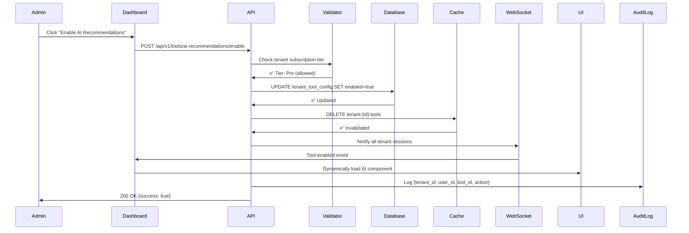
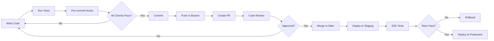

# NexSpaces API

**Production-Ready Composable Multi-Tenant SaaS Platform**

A secure, scalable, and maintainable Go backend with **7 core modules** (LMS, CMS, CRM, HMS, OMS, ECOM, ERP) and **dynamic tool system**. Build custom solutions by composing modules and toggling features at runtime with tenant isolation guarantees.

---

## 🎯 Project Status (October 2025)

### Current Phase: **Phase 8 Complete** ✅
**Next Focus:** Phase 9 – Schema-per-Tenant rollout (in progress)

**Build Status:** ✅ Successful (12MB binary)
**API Endpoints:** 60+ REST endpoints
**Test Coverage:** 36.8% domain (Target: 80%+)
**Last Updated:** October 7, 2025

### Completed Features

#### ✅ Phase 1-6: Foundation & Core
- Clean Architecture setup
- Foundational multi-tenant database structure
- JWT authentication & RBAC
- Tenant, User, Website management
- Graceful shutdown & health checks

#### ✅ Phase 7: Business Modules
- **Projects Module:** Portfolio/project management
- **Lessons Module:** Student, Lesson, Assignment (LMS foundation)
- **Booking Module:** Appointments, Availability
- **Services Module:** Service catalog, pricing
- **Blog/CMS Module:** Posts, Categories, rich content

#### ✅ Phase 8: API Documentation
- OpenAPI 3.0 specification
- Swagger UI at `/docs`
- Request/Response validation middleware
- Auto-generated client code

---

## 🏗️ Architecture Overview

### Composable Multi-Module Architecture

NexSpaces provides **7 core modules** that tenants can mix and match with **dynamic tool system** for ultimate flexibility.

| Core Module | Primary Use Case | Sector Examples | Isolation Model |
|-------------|------------------|-----------------|-----------------|
| **LMS** | Learning Management System | Education, corporate training | Schema-per-Tenant |
| **CMS** | Content Management System | Blogs, websites, documentation | Schema-per-Tenant |
| **CRM** | Customer Relationship Mgmt | Sales, marketing, support | Schema-per-Tenant |
| **PMS** | Property-Hotel Management System | Hotels, resorts, B&Bs | Schema-per-Database |
| **HMS** | Hospital Management System | | Schema-per-Database |
| **OMS** | Order Management System | Logistics, fulfillment, delivery | Schema-per-Database |
| **ECOM** | E-commerce Platform | Online stores, marketplaces | Schema-per-Database |
| **ERP** | Enterprise Resource Planning | Manufacturing, supply chain | Schema-per-Database |
| **SaaS** | Generic SaaS Boilerplate | Startups, new products | Schema-per-Tenant |

### Unified Multi-Tenancy Architecture: Schema-per-Tenant

The platform standardizes on a **Schema-per-Tenant** model. Core plumbing is implemented, and the rollout across all verticals is underway to ensure consistent isolation and operational tooling.

- **How it Works:** Every tenant (customer) is provisioned with their own dedicated schema within the same PostgreSQL database. When a user makes a request, our application middleware identifies the tenant and sets the database connection's `search_path` to that tenant's specific schema.

- **Schema Templates:** When a new tenant subscribes to a service (e.g., LMS), a pre-defined 'LMS Schema Template' is used to create all the necessary tables and structures within their new schema.

**Why Schema-per-Tenant?**

- **Strong Data Isolation:** Tenants are logically separated at the database level, preventing any possibility of data leaks between them.
- **Flexibility & Customization:** Allows for different database structures for different service plans in the future.
- **Simplified Application Code:** Eliminates the need for `WHERE tenant_id = ...` clauses in every query, leading to cleaner and more maintainable code.
- **Easy Tenant Management:** Simplifies tenant-specific operations like backup, restore, and migration.

### Clean Architecture Layers

```
┌─────────────────────────────────────────────────────────┐
│                 HTTP Layer (Handlers)                    │
│           Fiber, REST API, Middleware                    │
│           - Auth JWT validation                          │
│           - Tenant context injection                     │
│           - Request/Response validation                  │
└────────────────────┬────────────────────────────────────┘
                     │
┌────────────────────▼────────────────────────────────────┐
│              Use Cases (Business Logic)                  │
│         Services, Orchestration, DTOs                    │
│         - Tenant onboarding with tier selection          │
│         - HIPAA/PCI-DSS compliance enforcement           │
│         - Cross-module coordination                      │
└────────────────────┬────────────────────────────────────┘
                     │
┌────────────────────▼────────────────────────────────────┐
│               Repositories (Data Access)                 │
│         TenantConnectionManager                          │
│         - Sets `search_path` for the tenant session        │
│         - Manages database connection pooling              │
└────────────────────┬────────────────────────────────────┘
                     │
┌────────────────────▼────────────────────────────────────┐
│              Domain Entities (Core Business)             │
│         Tenant, User, Patient, InventoryItem             │
│         - Business rules & validation                    │
│         - Entity lifecycle                               │
└─────────────────────────────────────────────────────────┘
```

---

## 🧩 Modular Tool System

### Architecture Philosophy

NexSpaces implements a **composable architecture** where tenants build custom solutions by:

1. **Selecting Core Modules** → Choose from 7 modules (LMS + CRM + ECOM)
2. **Enabling Tools** → Activate sector-specific and module-specific tools
3. **Feature Toggles** → Runtime enable/disable via dashboard switches
4. **Custom Dashboards** → Dynamic UI composition based on enabled tools

### Three-Tier Tool Hierarchy

```
┌──────────────────────────────────────────────────────┐
│          Cross-Module Tools (Shared)                 │
│   Analytics, Reporting, Notifications, Search        │
└──────────────────────────────────────────────────────┘
                        ↓
┌──────────────────────────────────────────────────────┐
│          Module-Specific Tools                       │
│   CRM: Lead Scoring, Email Campaigns                 │
│   LMS: Quiz Engine, Live Classes, Certificates       │
│   HMS: Room Management, Housekeeping, PMS            │
│   ECOM: Abandoned Cart, AI Recommendations           │
└──────────────────────────────────────────────────────┘
                        ↓
┌──────────────────────────────────────────────────────┐
│          Sector-Specific Tools                       │
│   Education: Gradebook, Student Analytics            │
│   Hospitality: Channel Manager, Dynamic Pricing      │
│   Retail: Multi-warehouse, Supplier Management       │
└──────────────────────────────────────────────────────┘
```

### Module Registry

| Module | Core Tools (Included) | Optional Tools | Min. Tier |
|--------|----------------------|----------------|-----------|
| **LMS** | Courses, Students, Instructors | Quiz Engine, Live Classes, Certificates | Starter |
| **CRM** | Contacts, Deals, Pipeline | Lead Scoring, Email Marketing, SMS | Pro |
| **HMS** | Rooms, Bookings, Guests | PMS Integration, Channel Manager, Housekeeping | Pro |
| **ECOM** | Products, Orders, Customers | AI Recommendations, Abandoned Cart, Multi-warehouse | Starter |
| **OMS** | Order Tracking, Inventory | Delivery Mgmt, Route Optimization, 3PL Integration | Pro |
| **CMS** | Pages, Posts, Media | SEO Tools, CDN Integration, A/B Testing | Free |
| **ERP** | Inventory, Finance, HR | Supply Chain, Quality Control, BI Dashboard | Enterprise |

### Real-World Implementation Examples

#### Scenario 1: Boutique Hotel Chain
```yaml
tenant_id: hotel-acme
modules:
  - HMS   # Hotel Management System
  - CRM   # Guest relationship management
  - OMS   # F&B orders, room service

tools:
  HMS:
    - room_management          # ✅ Core (included)
    - booking_calendar         # ✅ Core (included)
    - housekeeping_scheduler   # ⭐ Optional ($49/mo)
    - pms_integration          # ⭐ Optional ($99/mo)
    - channel_manager          # ⭐ Optional ($199/mo)
  CRM:
    - guest_profiles           # ✅ Core
    - loyalty_program          # ⭐ Optional ($79/mo)
  OMS:
    - restaurant_orders        # ✅ Core
    - room_service             # ✅ Core

feature_switches:
  advanced_analytics: true
  ai_dynamic_pricing: false     # Not subscribed
  multi_property: true          # Enabled for chain
```

#### Scenario 2: E-commerce Startup
```yaml
tenant_id: store-fashion
modules:
  - ECOM  # E-commerce platform
  - CRM   # Customer relationship
  - CMS   # Content/blog

tools:
  ECOM:
    - product_catalog          # ✅ Core
    - shopping_cart            # ✅ Core
    - payment_gateway          # ✅ Core
    - inventory_management     # ✅ Core
    - ai_recommendations       # ⭐ Optional ($149/mo)
    - abandoned_cart_recovery  # ⭐ Optional ($79/mo)
  CRM:
    - customer_segmentation    # ✅ Core
    - email_marketing          # ⭐ Optional ($99/mo)
  CMS:
    - product_pages            # ✅ Core
    - blog                     # ✅ Core

feature_switches:
  ai_recommendations: true
  multi_warehouse: false        # Single warehouse
  dropshipping_integration: false
```

#### Scenario 3: Educational Institution
```yaml
tenant_id: university-tech
modules:
  - LMS   # Learning management
  - CRM   # Student recruitment
  - CMS   # University website

tools:
  LMS:
    - course_builder           # ✅ Core
    - student_enrollment       # ✅ Core
    - quiz_engine              # ⭐ Optional ($199/mo)
    - live_classes             # ⭐ Optional ($299/mo)
    - certificate_generator    # ⭐ Optional ($99/mo)
    - plagiarism_detection     # ⭐ Optional ($249/mo)
  CRM:
    - lead_management          # ✅ Core
    - admissions_pipeline      # ⭐ Optional ($149/mo)
  CMS:
    - course_catalog           # ✅ Core
    - news_blog                # ✅ Core

feature_switches:
  sso_integration: true         # SAML/OAuth
  mobile_app: true
  offline_mode: false
```

### Tool Activation Technical Flow

```go
// Tool configuration structure
type TenantToolConfig struct {
    TenantID    string                 `json:"tenant_id"`
    ModuleID    string                 `json:"module_id"`
    Tools       []ToolConfig           `json:"tools"`
    Switches    map[string]bool        `json:"switches"`
}

type ToolConfig struct {
    ToolID      string                 `json:"tool_id"`
    Enabled     bool                   `json:"enabled"`
    Tier        SubscriptionTier       `json:"tier"`       // free, starter, pro, enterprise
    Pricing     int                    `json:"pricing"`    // Monthly price in cents
    CustomProps map[string]interface{} `json:"custom_props"`
}

// Tool activation flow
// 1. Admin clicks toggle in dashboard
// 2. Frontend sends: POST /api/v1/tools/{toolID}/enable
// 3. Backend validates tenant subscription tier
// 4. Database updates tenant_tool_config table
// 5. Cache invalidation: DELETE tenant:{id}:tools
// 6. WebSocket notification to all tenant sessions
// 7. Frontend dynamically loads tool components
// 8. Audit log: {tenant_id, user_id, tool_id, action: "enabled"}
```

### Benefits of Modular Tool System

✅ **Pay for What You Use** → Granular billing per tool
✅ **No Code Deployment** → Runtime activation/deactivation
✅ **Tenant Flexibility** → Custom solution composition
✅ **Fast Onboarding** → Enable tools as needed
✅ **A/B Testing** → Gradual feature rollout
✅ **Scalability** → Independent tool scaling

---

## 🎛️ Feature Flags & Dynamic Tool System

### Implementation Strategy

NexSpaces uses a **database-driven feature flag system** for zero-downtime tool activation:

- **Database-driven:** Tool configurations stored per tenant in `tenant_tool_config` table
- **Real-time updates:** No deployment needed for tool changes
- **A/B testing:** Gradual rollout capability (10% → 50% → 100%)
- **RBAC integration:** Role-based tool visibility (Owner → Admin → Editor → Viewer)
- **Audit trail:** Track all tool enable/disable events with user context

### Tool Activation Flow (Step-by-Step)



### Performance Considerations

#### Caching Strategy
```go
// Three-tier caching for feature flags

// L1: In-memory cache (100ms TTL, per request)
type RequestCache struct {
    tools map[string]bool
    ttl   time.Duration
}

// L2: Redis cache (15min TTL, tenant-scoped)
cacheKey := fmt.Sprintf("tenant:%s:tools:%s", tenantID, moduleID)
redis.Set(cacheKey, toolsJSON, 15*time.Minute)

// L3: Database (source of truth)
// SELECT * FROM tenant_tool_config WHERE tenant_id = $1
```

#### Performance Metrics
- **Flag check latency:** <1ms (in-memory cache hit)
- **Tool activation:** <100ms (database update + cache invalidation)
- **WebSocket notification:** <50ms (to all tenant sessions)
- **UI component loading:** <200ms (lazy loaded)

### Feature Flag Evaluation

```go
// Feature flag interface
type FeatureFlagService interface {
    IsToolEnabled(ctx TenantContext, toolID string) bool
    GetToolConfig(ctx TenantContext, toolID string) (*ToolConfig, error)
    EnableTool(ctx TenantContext, toolID string) error
    DisableTool(ctx TenantContext, toolID string) error
}

// Usage in handlers
func (h *ProductHandler) GetRecommendations(c *fiber.Ctx) error {
    ctx := c.Locals("tenant_context").(TenantContext)

    // Check feature flag
    if !h.flags.IsToolEnabled(ctx, "ai_recommendations") {
        return c.Status(403).JSON(fiber.Map{
            "error": "AI Recommendations tool not enabled",
            "code": "TOOL_NOT_ENABLED",
        })
    }

    // Tool is enabled, proceed
    recommendations, err := h.aiService.GetRecommendations(ctx, productID)
    if err != nil {
        return err
    }

    return c.JSON(recommendations)
}
```

### Gradual Rollout (A/B Testing)

```go
type RolloutStrategy struct {
    ToolID      string  `json:"tool_id"`
    Percentage  int     `json:"percentage"`  // 0-100
    TargetTiers []string `json:"target_tiers"` // ["pro", "enterprise"]
    StartDate   time.Time `json:"start_date"`
    EndDate     time.Time `json:"end_date"`
}

// Example: Roll out AI recommendations to 10% of Pro tenants
rollout := RolloutStrategy{
    ToolID:      "ai_recommendations",
    Percentage:  10,
    TargetTiers: []string{"pro"},
    StartDate:   time.Now(),
    EndDate:     time.Now().Add(7 * 24 * time.Hour),
}

// Evaluation logic
func shouldEnableTool(tenantID string, rollout RolloutStrategy) bool {
    // Hash tenant ID to get consistent assignment
    hash := hashTenantID(tenantID)
    threshold := rollout.Percentage

    return (hash % 100) < threshold
}
```

### Security & Validation

#### Tier-Based Tool Access
```go
// Validate tenant tier before enabling tool
func (s *ToolService) EnableTool(ctx TenantContext, toolID string) error {
    tool, err := s.repo.GetTool(toolID)
    if err != nil {
        return fmt.Errorf("tool not found: %w", err)
    }

    // Check subscription tier
    if !s.hasRequiredTier(ctx.Subscription.Tier, tool.RequiredTier) {
        return &errors.InsufficientTierError{
            Current:  ctx.Subscription.Tier,
            Required: tool.RequiredTier,
            Message:  fmt.Sprintf("Upgrade to %s to enable this tool", tool.RequiredTier),
        }
    }

    // Check billing status
    if ctx.Subscription.Status != "active" {
        return errors.New("subscription not active")
    }

    // Enable tool
    return s.repo.EnableTool(ctx.TenantID, toolID)
}

// Tier hierarchy: Free < Starter < Pro < Enterprise
func (s *ToolService) hasRequiredTier(current, required SubscriptionTier) bool {
    tierHierarchy := map[SubscriptionTier]int{
        "free":       0,
        "starter":    1,
        "pro":        2,
        "enterprise": 3,
    }
    return tierHierarchy[current] >= tierHierarchy[required]
}
```

### Tool Dependency Management

```go
// Tools can have dependencies on other tools
type ToolDependencies struct {
    ToolID       string   `json:"tool_id"`
    RequiredTools []string `json:"required_tools"`
    OptionalTools []string `json:"optional_tools"`
}

// Example: AI recommendations depends on analytics
dependencies := ToolDependencies{
    ToolID:       "ai_recommendations",
    RequiredTools: []string{"analytics_basic", "product_catalog"},
    OptionalTools: []string{"customer_segmentation"}, // Enhanced if available
}

// Validation before enabling
func (s *ToolService) validateDependencies(ctx TenantContext, toolID string) error {
    deps, err := s.repo.GetToolDependencies(toolID)
    if err != nil {
        return err
    }

    for _, requiredTool := range deps.RequiredTools {
        if !s.IsToolEnabled(ctx, requiredTool) {
            return fmt.Errorf("required tool '%s' must be enabled first", requiredTool)
        }
    }

    return nil
}
```

### Frontend Integration

```typescript
// React hook for feature flags
function useFeatureFlag(toolId: string): boolean {
  const { tenantId } = useTenantContext();
  const [enabled, setEnabled] = useState(false);

  useEffect(() => {
    // Initial check
    fetch(`/api/v1/tools/${toolId}/status`)
      .then(res => res.json())
      .then(data => setEnabled(data.enabled));

    // Listen for WebSocket updates
    const ws = new WebSocket(`wss://api.nexpaces.com/ws/${tenantId}`);
    ws.onmessage = (event) => {
      const data = JSON.parse(event.data);
      if (data.type === 'tool.updated' && data.tool_id === toolId) {
        setEnabled(data.enabled);
      }
    };

    return () => ws.close();
  }, [toolId, tenantId]);

  return enabled;
}

// Usage in components
function ProductPage() {
  const aiRecommendationsEnabled = useFeatureFlag('ai_recommendations');

  return (
    <div>
      {aiRecommendationsEnabled && (
        <AIRecommendations productId={product.id} />
      )}
    </div>
  );
}
```

### Monitoring & Analytics

```json
// Tool usage metrics
{
  "tenant_id": "hotel-acme",
  "tool_id": "ai_dynamic_pricing",
  "metrics": {
    "enabled_at": "2025-01-15T10:30:00Z",
    "enabled_by": "user-admin-123",
    "usage_count_24h": 1420,
    "active_users": 8,
    "api_calls": 3200,
    "avg_latency_ms": 35,
    "error_rate": 0.01,
    "billing_impact": "+$199/mo"
  }
}
```

---

## 🚀 Getting Started

### Prerequisites

- **Go:** 1.21+
- **PostgreSQL:** 15+
- **Docker:** 24+ (recommended)
- **Make:** For development commands

### Quick Start (Docker)

```bash
# Clone repository
git clone <repo-url>
cd nexpaces-api

# Copy environment config
cp .env.example .env

# Start all services
docker-compose up -d

# Check health
curl http://localhost:8080/health

# View logs
docker-compose logs -f api

# Access Swagger UI
open http://localhost:8080/docs
```

### Local Development

```bash
# Install dependencies
go mod download

# Setup database
createdb nexpaces_dev

# Run migrations
make migrate-up

# Start server
make dev

# Run tests
make test

# API available at http://localhost:8080
```

---

## 📁 Directory Structure

```
nexpaces-api/
├── cmd/
│   └── server/main.go           # Entry point
│
├── internal/
│   ├── domain/                  # Business entities
│   │   ├── tenant/              # Tenant + IsolationLevel
│   │   ├── user/                # User + RBAC
│   │   ├── lesson/              # Student, Lesson, Assignment (LMS)
│   │   ├── booking/             # Appointment, Availability (HMS)
│   │   ├── service/             # Service catalog
│   │   ├── blog/                # Post, Category (CMS)
│   │   └── project/             # Project management
│   │
│   ├── repository/              # Data access (PostgreSQL)
│   │   └── */postgres.go        # Implementations
│   │
│   ├── usecase/                 # Business logic
│   │   └── */service.go         # Services + DTOs
│   │
│   ├── handler/                 # HTTP endpoints
│   │   └── */handler.go         # Fiber handlers
│   │
│   ├── middleware/              # HTTP middleware
│   │   ├── auth.go              # JWT validation
│   │   ├── tenant.go            # Tenant context
│   │   └── logger.go            # Structured logging
│   │
│   └── app/                     # Application bootstrap
│       ├── app.go               # Dependency injection
│       └── routes.go            # Route registration
│
├── pkg/                         # Shared packages
│   ├── database/
│   │   ├── postgres.go          # Connection pool
│   │   └── tenant_manager.go    # ⭐ Tenant connection management
│   ├── logger/                  # Zerolog structured logs
│   ├── validator/               # Custom validators
│   └── errors/                  # Error types
│
├── migrations/                  # Database migrations
│   ├── 001_create_tenants.*
│   └── ...
│
├── api/
│   └── openapi.yaml             # OpenAPI 3.0 spec
│
├── web/
│   └── static/docs/             # Swagger UI
│
├── docker/
│   └── Dockerfile               # Multi-stage build
│
├── scripts/
│   └── provision_tenant.go   # ⭐ Tenant schema provisioning script
│
├── .env.example
├── docker-compose.yml
├── Makefile
└── README.md                    # This file
```

---

### 📍 Geliştirme Rehberi (Nerede Ne Yapılır?)

Bu rehber, sık karşılaşılan geliştirme görevlerinin proje yapısının hangi kısımlarında gerçekleştirileceğini detaylı olarak açıklar.

#### Senaryo 1: Yeni Bir API Endpoint'i Ekleme (Örnek: `GET /api/v1/tools/:id/statistics`)

1.  **Handler Fonksiyonunu Oluşturma:**
    *   **Nereye?** `internal/handler/tool/handler.go` (varsayımsal `tool` modülü için)
    *   **Ne Yapılır?** Gelen isteği (`*fiber.Ctx`) işleyen, gerekli servisleri çağıran ve yanıtı (JSON veya hata) döndüren fonksiyonu yazın.
    ```go
    // internal/handler/tool/handler.go
    func (h *ToolHandler) GetToolStatistics(c *fiber.Ctx) error {
        toolID := c.Params("id")
        stats, err := h.toolService.GetStatistics(c.UserContext(), toolID)
        if err != nil {
            return c.Status(fiber.StatusInternalServerError).JSON(fiber.Map{"error": err.Error()})
        }
        return c.JSON(stats)
    }
    ```

2.  **Rotayı (Route) Ekleme:**
    *   **Nereye?** `internal/app/routes.go`
    *   **Ne Yapılır?** `SetupRoutes` fonksiyonu içinde, oluşturduğunuz handler'ı uygun HTTP metodu ve URL yolu ile eşleştirin. Rotayı kimlik doğrulama (auth) middleware'i ile korumayı unutmayın.
    ```go
    // internal/app/routes.go
    func (a *Application) SetupRoutes(app *fiber.App) {
        // ... diğer rotalar
        apiV1 := app.Group("/api/v1", middleware.AuthMiddleware(a.Config.Auth.JWTSecret))
        apiV1.Get("/tools/:id/statistics", a.ToolHandler.GetToolStatistics)
        // ...
    }
    ```

#### Senaryo 2: Yeni Bir İş Mantığı (Use Case) Ekleme (Örnek: `GetStatistics`)

1.  **Servis (Use Case) Arayüzünü Güncelleme:**
    *   **Nereye?** `internal/usecase/tool/service.go`
    *   **Ne Yapılır?** `Service` interface'ine yeni metodun imzasını ekleyin. Bu, "Clean Architecture" prensiplerine uygun olarak dış katmanlarla olan kontratı tanımlar.
    ```go
    // internal/usecase/tool/service.go
    type Service interface {
        // ... diğer metodlar
        GetStatistics(ctx context.Context, toolID string) (*ToolStats, error)
    }
    ```

2.  **Servis Fonksiyonunu Yazma:**
    *   **Nereye?** `internal/usecase/tool/service.go`
    *   **Ne Yapılır?** `service` struct'ı üzerinde metodu implemente edin. Bu fonksiyon, iş mantığını barındırır ve gerekli repository'leri çağırır.
    ```go
    // internal/usecase/tool/service.go
    func (s *service) GetStatistics(ctx context.Context, toolID string) (*ToolStats, error) {
        // İş mantığı burada: validasyon, hesaplama, vb.
        tool, err := s.toolRepo.FindByID(ctx, toolID)
        if err != nil {
            return nil, fmt.Errorf("tool bulunamadı: %w", err)
        }
        // ... istatistikleri hesapla ...
        return &ToolStats{...}, nil
    }
    ```

#### Senaryo 3: Veritabanı İşlemi Ekleme (Örnek: `FindByID`)

1.  **Repository Arayüzünü Güncelleme:**
    *   **Nereye?** `internal/domain/tool/repository.go`
    *   **Ne Yapılır?** `Repository` interface'ine yeni veritabanı erişim metodunu ekleyin.
    ```go
    // internal/domain/tool/repository.go
    type Repository interface {
        // ... diğer metodlar
        FindByID(ctx context.Context, toolID string) (*Tool, error)
    }
    ```

2.  **Repository Fonksiyonunu Yazma (PostgreSQL için):**
    *   **Nereye?** `internal/repository/tool/postgres.go`
    *   **Ne Yapılır?** PostgreSQL'e özgü sorguyu yazın. `sqlx` veya `pgx` kullanarak veriyi çekin ve domain modeline (`Tool`) map edin. Tenant izolasyonunun (`search_path`) middleware tarafından halledildiğini unutmayın.
    ```go
    // internal/repository/tool/postgres.go
    func (r *postgresRepository) FindByID(ctx context.Context, toolID string) (*domain.Tool, error) {
        var tool domain.Tool
        query := `SELECT * FROM tools WHERE id = $1`
        if err := r.db.GetContext(ctx, &tool, query, toolID); err != nil {
            return nil, err
        }
        return &tool, nil
    }
    ```

#### Senaryo 4: Yeni Bir Veri Modeli (Domain Entity) Oluşturma

*   **Nereye?** `internal/domain/` altında yeni bir modül klasörü (örn: `internal/domain/invoice/`) veya mevcut bir modül içine.
*   **Ne Yapılır?** `entity.go` adında bir dosya oluşturun ve Go struct'ı olarak temel veri modelinizi tanımlayın. Bu struct, iş kurallarını ve validasyonları içerebilir.
    ```go
    // internal/domain/invoice/entity.go
    package invoice

    type Invoice struct {
        ID         uuid.UUID
        Amount     int
        Status     string // "draft", "paid", "void"
        DueDate    time.Time
        TenantID   uuid.UUID
    }
    ```

## 🔧 Configuration

### Critical Environment Variables

```bash
# Database
DATABASE_HOST=localhost
DATABASE_PORT=5432
DATABASE_NAME=nexpaces_dev
DATABASE_USER=postgres
DATABASE_PASSWORD=postgres
DATABASE_SSLMODE=disable

# Server
SERVER_HOST=0.0.0.0
SERVER_PORT=8080
SERVER_ENVIRONMENT=development

# Security
AUTH_JWT_SECRET=your-secret-key-min-32-chars-change-in-production
SECURITY_ALLOWED_ORIGINS=http://localhost:3000
SECURITY_RATE_LIMIT_REQUESTS=100
SECURITY_RATE_LIMIT_DURATION=1m
```

See `.env.example` for complete configuration.

---

## 📡 API Endpoints

### Health Check
```bash
GET /health                      # Service health
```

### Authentication (4 endpoints)
```bash
POST /api/v1/auth/register       # Register new user
POST /api/v1/auth/login          # Login (returns JWT)
POST /api/v1/auth/logout         # Logout
GET  /api/v1/auth/me             # Get current user (protected)
```

### Tenants (13 endpoints)
```bash
POST   /api/v1/tenants           # Create tenant
GET    /api/v1/tenants/current   # Get current tenant
GET    /api/v1/tenants/stats     # Tenant statistics
GET    /api/v1/tenants/:id       # Get by ID
PATCH  /api/v1/tenants/:id       # Update tenant
POST   /api/v1/tenants/:id/upgrade  # Upgrade plan
POST   /api/v1/tenants/:id/suspend  # Suspend tenant
POST   /api/v1/tenants/:id/activate # Activate tenant
DELETE /api/v1/tenants/:id       # Delete tenant
# ... and more
```

### Users (11 endpoints)
```bash
POST   /api/v1/users             # Create user (admin)
GET    /api/v1/users/stats       # User statistics
GET    /api/v1/users/:id         # Get by ID
PATCH  /api/v1/users/:id         # Update user
POST   /api/v1/users/:id/password   # Change password
POST   /api/v1/users/:id/role    # Update role (admin)
DELETE /api/v1/users/:id         # Delete user
# ... and more
```

### Module Management (8 endpoints) 🆕
```bash
GET    /api/v1/modules                      # List available modules
GET    /api/v1/modules/:id                  # Get module details + tools
POST   /api/v1/modules/:id/activate         # Activate module for tenant
POST   /api/v1/modules/:id/deactivate       # Deactivate module
GET    /api/v1/modules/:id/dependencies     # Get module dependencies
GET    /api/v1/modules/:id/schema           # Get schema template
POST   /api/v1/modules/:id/provision        # Provision module schema
GET    /api/v1/modules/marketplace          # Browse marketplace
```

### Tool Management (12 endpoints) 🆕
```bash
GET    /api/v1/tools                        # List available tools
GET    /api/v1/tools/:id                    # Get tool details
POST   /api/v1/tools/:id/enable             # Enable tool (feature flag)
POST   /api/v1/tools/:id/disable            # Disable tool
GET    /api/v1/tools/:id/config             # Get tool configuration
PUT    /api/v1/tools/:id/config             # Update tool config
GET    /api/v1/tools/:id/status             # Check if tool enabled
GET    /api/v1/tools/:id/dependencies       # Get tool dependencies
GET    /api/v1/tools/:id/pricing            # Get tool pricing
POST   /api/v1/tools/:id/subscribe          # Subscribe to paid tool
POST   /api/v1/tools/:id/unsubscribe        # Unsubscribe from tool
GET    /api/v1/tools/marketplace            # Browse tool marketplace
```

### Tenant Dashboard (6 endpoints) 🆕
```bash
GET    /api/v1/tenants/:id/modules          # Get active modules
GET    /api/v1/tenants/:id/tools            # Get enabled tools
GET    /api/v1/tenants/:id/tools/usage      # Tool usage statistics
POST   /api/v1/tenants/:id/tools/bulk       # Bulk enable/disable tools
GET    /api/v1/tenants/:id/dashboard/config # Get dashboard configuration
PUT    /api/v1/tenants/:id/dashboard/config # Update dashboard layout
```

### Projects, Lessons, Bookings, Services, Blog
See [UYGULAMA_YOL_HARITASI.md](docs/planning/UYGULAMA_YOL_HARITASI.md) for complete endpoint list.

### Documentation
```bash
GET /docs                        # Swagger UI
GET /api/openapi.yaml            # OpenAPI spec
```

**Total Endpoints:** 86+ (60 existing + 26 new module/tool endpoints)

---

## 🔒 Security Features

### Multi-Tenant Isolation

Our security model is built on the robust **Schema-per-Tenant** database architecture. This provides strong, logical data isolation as a primary defense layer.

1.  **Database Schema Isolation:** Each tenant's data resides in a dedicated schema. It is impossible for one tenant's queries to access another tenant's data.
2.  **Application Layer:** All incoming requests are mapped to a tenant. The application then configures the database session to use that tenant's specific schema, ensuring all subsequent operations are correctly scoped.

```go
// Every request has tenant context
tenantID := c.Locals("tenant_id").(string)

// The connection manager sets the search path for the session
// db.Exec("SET search_path TO ?", tenantSchemaName)

// All queries are now automatically scoped to the tenant's schema
query := `SELECT * FROM users WHERE id = $1`
```

### Tool-Level Security 🆕

Every tool operation requires **multi-layered security validation**:

```go
// Tool access control flow
func (h *ToolHandler) ExecuteToolAction(c *fiber.Ctx) error {
    ctx := c.Locals("tenant_context").(TenantContext)
    toolID := c.Params("toolId")

    // Layer 1: Tenant isolation
    if !h.validateTenantAccess(ctx, toolID) {
        return c.Status(403).JSON(fiber.Map{
            "error": "Tool not available for this tenant",
            "code": "TENANT_TOOL_MISMATCH",
        })
    }

    // Layer 2: Tool enabled check
    if !h.flags.IsToolEnabled(ctx, toolID) {
        return c.Status(403).JSON(fiber.Map{
            "error": "Tool not enabled. Enable in dashboard.",
            "code": "TOOL_NOT_ENABLED",
        })
    }

    // Layer 3: RBAC permission check
    requiredPermission := fmt.Sprintf("tool:%s:execute", toolID)
    if !h.rbac.HasPermission(ctx.UserID, requiredPermission) {
        return c.Status(403).JSON(fiber.Map{
            "error": "Insufficient permissions",
            "code": "PERMISSION_DENIED",
        })
    }

    // Layer 4: ABAC policy evaluation (OPA/Cedar)
    decision := h.policy.Evaluate(PolicyRequest{
        TenantID:  ctx.TenantID,
        UserID:    ctx.UserID,
        Resource:  toolID,
        Action:    "execute",
        Context: map[string]interface{}{
            "ip_address":    c.IP(),
            "user_agent":    c.Get("User-Agent"),
            "time":          time.Now(),
            "subscription":  ctx.Subscription.Tier,
            "device_type":   c.Get("X-Device-Type"),
        },
    })

    if !decision.Allowed {
        h.audit.Log(AuditEvent{
            TenantID:   ctx.TenantID,
            UserID:     ctx.UserID,
            Action:     "tool.execute.denied",
            Resource:   toolID,
            Reason:     decision.Reason,
            PolicyVersion: decision.PolicyVersion,
        })
        return c.Status(403).JSON(fiber.Map{
            "error": decision.Reason,
            "code": "POLICY_DENIED",
        })
    }

    // Proceed with tool execution
    result, err := h.toolService.Execute(ctx, toolID, c.Body())
    if err != nil {
        return err
    }

    // Audit success
    h.audit.Log(AuditEvent{
        TenantID:   ctx.TenantID,
        UserID:     ctx.UserID,
        Action:     "tool.execute.success",
        Resource:   toolID,
        DecisionID: decision.ID,
    })

    return c.JSON(result)
}
```

### ABAC (Attribute-Based Access Control) 🆕

NexSpaces implements **policy-as-code** using Open Policy Agent (OPA) with Rego:

```rego
# OPA Policy: Tool access based on attributes
package nexpaces.tools

import future.keywords.if

# Default deny
default allow = false

# Allow tool access if all conditions met
allow if {
    # Tenant has tool enabled
    tool_enabled(input.tenant_id, input.tool_id)

    # User has required role
    user_has_role(input.user_id, ["owner", "admin"])

    # Subscription tier sufficient
    tier_sufficient(input.subscription_tier, input.tool_required_tier)

    # Time-based restriction (business hours only for certain tools)
    time_allowed(input.tool_id, input.request_time)

    # Location-based (GDPR compliance for EU tenants)
    location_allowed(input.tenant_region, input.tool_id)

    # Device type allowed (mobile restrictions for heavy tools)
    device_allowed(input.device_type, input.tool_id)
}

# Helper functions
tool_enabled(tenant_id, tool_id) if {
    data.tenant_tools[tenant_id][tool_id].enabled == true
}

tier_sufficient(current, required) if {
    tier_hierarchy := {"free": 0, "starter": 1, "pro": 2, "enterprise": 3}
    tier_hierarchy[current] >= tier_hierarchy[required]
}

time_allowed(tool_id, request_time) if {
    tool_config := data.tools[tool_id]
    tool_config.time_restriction == false
} else if {
    tool_config := data.tools[tool_id]
    tool_config.time_restriction == true
    is_business_hours(request_time, tool_config.business_hours)
}

location_allowed(region, tool_id) if {
    tool := data.tools[tool_id]
    tool.gdpr_restricted == false
} else if {
    tool := data.tools[tool_id]
    tool.gdpr_restricted == true
    region in ["EU", "UK"]
}
```

### Audit Logging (Comprehensive)

Every tool and security event is audited with full context:

```go
type AuditEvent struct {
    // Identity
    TenantID      string    `json:"tenant_id"`
    UserID        string    `json:"user_id"`
    SessionID     string    `json:"session_id"`

    // Action
    Action        string    `json:"action"`          // tool.enable, tool.execute, etc.
    Resource      string    `json:"resource"`        // tool_id, module_id
    ResourceType  string    `json:"resource_type"`   // tool, module, dashboard

    // Decision
    Allowed       bool      `json:"allowed"`
    PolicyVersion string    `json:"policy_version"`  // OPA policy version
    DecisionID    string    `json:"decision_id"`     // Unique decision identifier
    Reason        string    `json:"reason,omitempty"` // Denial reason

    // Context
    IPAddress     string    `json:"ip_address"`
    UserAgent     string    `json:"user_agent"`
    DeviceType    string    `json:"device_type"`
    Timestamp     time.Time `json:"timestamp"`

    // Security
    ThreatScore   float64   `json:"threat_score,omitempty"` // 0-1 (ML-based)
    Anomaly       bool      `json:"anomaly"`                // Unusual behavior flag
}

// Audit log storage: Immutable, append-only
// - PostgreSQL (for queries)
// - S3 (for long-term retention, compliance)
// - SIEM integration (Splunk, DataDog)
```

### Cross-Tenant Access Prevention

```go
// ⚠️ CRITICAL: Every query must include tenant validation

// ❌ BAD: Missing tenant check
func GetToolData(toolID string) (*ToolData, error) {
    query := `SELECT * FROM tool_data WHERE tool_id = $1`
    // SECURITY BREACH: Could access other tenant's data!
}

// ✅ GOOD: Tenant-scoped query
func GetToolData(ctx TenantContext, toolID string) (*ToolData, error) {
    // Set search_path for schema-per-tenant
    db.Exec("SET search_path TO $1", ctx.TenantSchemaName)

    // Query is now automatically scoped to tenant's schema
    query := `SELECT * FROM tool_data WHERE tool_id = $1`
    var data ToolData
    err := db.Get(&data, query, toolID)

    // Additional paranoid check (defense in depth)
    if data.TenantID != ctx.TenantID {
        return nil, errors.New("cross-tenant data access detected")
    }

    return &data, err
}
```

### Security Checklist

**Core Security (Implemented)**
- ✅ JWT authentication (bcrypt, cost 12)
- ✅ RBAC (Owner, Admin, Editor, Viewer)
- ✅ **Schema-per-Tenant** database isolation
- ✅ Input validation (struct tags + Zod)
- ✅ SQL injection prevention (prepared statements)
- ✅ CORS configuration
- ✅ Rate limiting per IP
- ✅ Security headers (Helmet middleware)

**Advanced Security (New)**
- ✅ ABAC policy engine (OPA/Cedar)
- ✅ Tool-level access control
- ✅ Comprehensive audit logging
- ✅ Cross-tenant access prevention
- ✅ Multi-layered validation (Tenant → Feature Flag → RBAC → ABAC)
- ✅ Anomaly detection (threat scoring)

**Planned**
- ⏳ HIPAA compliance (encryption, audit logs)
- ⏳ PCI-DSS compliance (tokenization)
- ⏳ OAuth 2.0 (Google, GitHub, Apple)
- ⏳ 2FA/MFA (TOTP)
- ⏳ Runtime threat detection (WAF integration)

---

## 🗄️ Database Strategy

### Multi-Tenant Approach

**Strategy:** **Schema-per-Tenant** on a PostgreSQL Database.

This model is applied uniformly to all tenants and verticals, ensuring consistency and strong data isolation.

```sql
-- Example: A new tenant 'acme' is created
CREATE SCHEMA tenant_acme;

-- The system then uses a schema template (e.g., for an LMS plan)
-- to create tables within the 'tenant_acme' schema.

-- Example 'users' table is now inside the tenant's schema
CREATE TABLE tenant_acme.users (
    id UUID PRIMARY KEY,
    -- No tenant_id column is needed here
    email VARCHAR(255) NOT NULL,
    password VARCHAR(255) NOT NULL,
    role VARCHAR(50) NOT NULL,
    created_at TIMESTAMP DEFAULT NOW()
);

-- When a request for 'acme' comes in, the session is set
-- SET search_path TO tenant_acme;
```

### Subscription Plans

| Plan | Users | Websites | Storage | Custom Domain | Price |
|------|-------|----------|---------|---------------|-------|
| **Free** | 1 | 1 | 100MB | ❌ | $0 |
| **Starter** | 5 | 3 | 1GB | ❌ | $29 |
| **Pro** | 20 | 10 | 10GB | ✅ | $199 |
| **Enterprise** | Unlimited | Unlimited | Unlimited | ✅ | Custom |

---

## 🛠️ Development Commands

```bash
# Development
make dev            # Run development server
make build          # Build production binary
make test           # Run all tests
make test-coverage  # Tests with coverage report

# Database
make migrate-up     # Run all migrations
make migrate-down   # Rollback last migration
make migrate-status # Check migration status

# Code Quality
make lint           # Run linters (gofmt, go vet)
make fmt            # Format code

# Docker
make docker-up      # Start docker-compose stack
make docker-down    # Stop docker-compose stack
make docker-logs    # View API logs
make docker-reset   # Reset Docker environment

# OpenAPI
make openapi-gen    # Regenerate API client code
make openapi-lint   # Validate OpenAPI spec
make docs           # Update API documentation

# Quality Gates (Pre-commit) 🆕
make pre-commit     # Run all pre-commit checks
make security-scan  # Security vulnerability scan
make tenant-check   # Tenant isolation validation
```

### Pre-commit Hooks (Automated Quality Gates) 🆕

All commits must pass automated quality checks:

```yaml
# .pre-commit-config.yaml
repos:
  - repo: local
    hooks:
      - id: go-fmt
        name: Go Format Check
        entry: gofmt -l -s .
        language: system
        files: \.go$
        pass_filenames: false

      - id: go-vet
        name: Go Vet Static Analysis
        entry: go vet ./...
        language: system
        pass_filenames: false

      - id: golangci-lint
        name: GolangCI Lint
        entry: golangci-lint run --timeout=5m
        language: system
        pass_filenames: false

      - id: test-coverage
        name: Test Coverage Check (min 75%)
        entry: bash -c 'go test -coverprofile=coverage.out ./... && go tool cover -func=coverage.out | grep total | awk "{if (\$3 < 75.0) exit 1}"'
        language: system
        pass_filenames: false

      - id: tenant-isolation-check
        name: Tenant Isolation Validation
        entry: ./scripts/check-tenant-isolation.sh
        language: system
        files: \.(go|sql)$

      - id: security-scan
        name: Security Vulnerability Scan
        entry: gosec -quiet ./...
        language: system
        pass_filenames: false

# Install: pre-commit install
# Run manually: pre-commit run --all-files
```

### Development Workflow



---

## 🧪 Testing

### Run Tests

```bash
# All tests
go test -v ./...

# With coverage
go test -coverprofile=coverage.out ./...
go tool cover -html=coverage.out

# Specific package
go test -v ./internal/domain/tenant
```

### Current Test Coverage

| Layer | Current | Target |
|-------|---------|--------|
| Domain | 36.8% | 80%+ |
| Repository | 0% | 70%+ |
| Service | 0% | 80%+ |
| Handler | 0% | 60%+ |
| **Total** | ~10% | **75%+** |

See [UYGULAMA_YOL_HARITASI.md](docs/planning/UYGULAMA_YOL_HARITASI.md) Phase 11 for test plan.

---

## 📚 Clean Code & Development Standards

### Core Principles (Mandatory)

NexSpaces enforces **DRY, KISS, YAGNI** principles across all code:

#### DRY (Don't Repeat Yourself)
```go
// ❌ BAD: Code duplication
func CreateUserForTenant(tenantID, email string) error {
    if email == "" {
        return errors.New("email required")
    }
    // database logic...
}

func CreateAdminForTenant(tenantID, email string) error {
    if email == "" {
        return errors.New("email required")
    }
    // database logic...
}

// ✅ GOOD: Extract common validation
func validateEmail(email string) error {
    if email == "" {
        return errors.New("email required")
    }
    return nil
}

// ⚠️ RULE: ≥3 repetitions → extract to function/struct
```

#### KISS (Keep It Simple, Stupid)
```go
// ❌ BAD: Unnecessary complexity
func calculateToolPrice(tool Tool, tenant Tenant) int {
    return tool.BasePrice *
        (tenant.Premium ? 1.5 : 1.0) *
        (tenant.Verified ? 1.2 : 1.0) *
        (tenant.Region == "EU" ? 1.1 : 1.0)
}

// ✅ GOOD: Clear and explicit
func calculateToolPrice(tool Tool, tenant Tenant) int {
    basePrice := tool.BasePrice

    if tenant.Premium {
        basePrice = int(float64(basePrice) * 1.5)
    }

    if tenant.Verified {
        basePrice = int(float64(basePrice) * 1.2)
    }

    if tenant.Region == "EU" {
        basePrice = int(float64(basePrice) * 1.1)
    }

    return basePrice
}

// ⚠️ RULE: Simplest working solution always wins
```

#### YAGNI (You Aren't Gonna Need It)
```go
// ❌ BAD: Future-proofing that's not needed
type Tool struct {
    ID          string
    Name        string

    // Future features - UNUSED!
    SocialIDs   map[string]string `json:"social_ids,omitempty"`
    Metadata    map[string]any    `json:"metadata,omitempty"`
    Extensions  []Extension       `json:"extensions,omitempty"`
}

// ✅ GOOD: Only what's needed today
type Tool struct {
    ID       string `json:"id"`
    Name     string `json:"name"`
    TenantID string `json:"tenant_id"` // ⚠️ Multi-tenant mandatory
    Enabled  bool   `json:"enabled"`
}

// ⚠️ RULE: Don't build features before they're needed
```

### Go Code Standards

#### Function Size & Complexity
```go
// ⚠️ RULES:
// - Max 20-25 lines per function
// - Max 3-4 parameters
// - Max 3 levels of nesting
// - Cyclomatic complexity ≤ 10

// ❌ BAD: Too many parameters
func CreateTool(name, desc, category, tier, price, icon, status string) error

// ✅ GOOD: Use struct for complex params
type CreateToolRequest struct {
    Name     string           `json:"name" validate:"required"`
    Desc     string           `json:"desc" validate:"required"`
    Category ToolCategory     `json:"category"`
    Tier     SubscriptionTier `json:"tier"`
    Price    int              `json:"price"`
}

func CreateTool(req CreateToolRequest) error {
    if err := validate.Struct(req); err != nil {
        return fmt.Errorf("validation failed: %w", err)
    }
    // implementation...
}
```

#### Error Handling (Critical)
```go
// ⚠️ MANDATORY: Wrap all errors with context

// ❌ BAD: Silent failures
func EnableTool(toolID string) {
    db.Update(toolID) // Error ignored!
}

// ❌ BAD: Generic error messages
func EnableTool(toolID string) error {
    if err != nil {
        return errors.New("failed") // No context!
    }
}

// ✅ GOOD: Explicit error wrapping
func EnableTool(ctx TenantContext, toolID string) error {
    if err := s.validateTier(ctx, toolID); err != nil {
        return fmt.Errorf("tier validation failed for tool %s: %w", toolID, err)
    }

    if err := s.repo.EnableTool(ctx.TenantID, toolID); err != nil {
        return fmt.Errorf("failed to enable tool %s for tenant %s: %w",
            toolID, ctx.TenantID, err)
    }

    return nil
}
```

#### Naming Conventions
```go
// ⚠️ RULE: Names should explain behavior, not need comments

// ❌ BAD: Unclear names
func process(data interface{}) error
func handleStuff(x, y string) bool
var flag bool

// ✅ GOOD: Self-documenting names
func provisionTenantSchema(tenantID string) error
func validateToolDependencies(toolID string, enabledTools []string) bool
var isToolEnabled bool

// Variable naming patterns:
// - Booleans: is*, has*, can*, should*
// - Functions: verb + noun (createUser, enableTool)
// - Structs: noun (TenantConfig, ToolService)
```

### Testing Requirements

#### Table-Driven Tests (Mandatory)
```go
// ✅ GOOD: Table-driven multi-tenant tests
func TestToolService_EnableTool_TenantIsolation(t *testing.T) {
    testCases := []struct {
        name        string
        tenant1     TenantContext
        tenant2     TenantContext
        toolID      string
        expectError bool
        errorCode   string
    }{
        {
            name: "same tool different tenants should succeed",
            tenant1: TenantContext{
                TenantID: "tenant-1",
                Subscription: Subscription{Tier: "pro"},
            },
            tenant2: TenantContext{
                TenantID: "tenant-2",
                Subscription: Subscription{Tier: "pro"},
            },
            toolID:      "ai_recommendations",
            expectError: false,
        },
        {
            name: "cross-tenant tool access should fail",
            tenant1: TenantContext{TenantID: "tenant-1"},
            tenant2: TenantContext{TenantID: "tenant-1"}, // Same tenant
            toolID: "ai_recommendations",
            expectError: true,
            errorCode: "DUPLICATE_TOOL",
        },
    }

    for _, tc := range testCases {
        t.Run(tc.name, func(t *testing.T) {
            // Test implementation...
        })
    }
}

// ⚠️ RULE: Test naming format: TestService_Method_Scenario
```

#### Coverage Requirements
```yaml
Mandatory_Coverage:
  domain: 80%+
  repository: 70%+
  service: 80%+
  handler: 60%+
  total: 75%+

Test_Categories:
  unit_tests:
    - Business logic validation
    - Edge cases (nil, empty, invalid)
    - Multi-tenant scenarios

  integration_tests:
    - Database operations
    - Cross-module dependencies
    - API contract tests

  e2e_tests:
    - Critical user journeys
    - Tool activation flows
    - Multi-tenant isolation
```

### Code Review Checklist

Before submitting a PR, verify:

**1. Tenant Isolation**
- [ ] Cross-tenant access prevented?
- [ ] `tenant_id` in all database queries?
- [ ] Cache keys tenant-scoped?
- [ ] Session isolation enforced?

**2. Security**
- [ ] Input validation (all endpoints)?
- [ ] SQL injection prevention (prepared statements)?
- [ ] XSS protection (sanitization)?
- [ ] CSRF tokens (state-changing operations)?
- [ ] PII masking in logs?

**3. Performance**
- [ ] N+1 queries avoided?
- [ ] Database indexes used (tenant_id first)?
- [ ] Cache strategy implemented?
- [ ] Connection pooling configured?

**4. Clean Code**
- [ ] Functions <25 lines?
- [ ] Parameters ≤4?
- [ ] Nesting ≤3 levels?
- [ ] DRY principle followed?
- [ ] Errors wrapped with context?

**5. Testing**
- [ ] Multi-tenant test scenarios?
- [ ] Edge cases covered?
- [ ] Coverage targets met?
- [ ] Table-driven tests used?

**6. Documentation**
- [ ] Public APIs documented (godoc)?
- [ ] Complex logic explained (WHY, not WHAT)?
- [ ] README updated?
- [ ] CHANGELOG entry added?

---

## 🚀 Deployment

### Docker Build

```bash
# Build production image
docker build -f docker/Dockerfile -t nexpaces-api:latest .

# Run container
docker run -p 8080:8080 \
  -e DATABASE_HOST=your-db-host \
  -e DATABASE_PASSWORD=your-password \
  -e JWT_SECRET=your-secret \
  nexpaces-api:latest
```

### Production Environment

```bash
SERVER_ENVIRONMENT=production
DATABASE_HOST=prod-db.amazonaws.com
DATABASE_SSLMODE=require
JWT_SECRET=***-change-in-production
SENTRY_DSN=https://***@sentry.io/*** 
```

---

## 📈 Monitoring & Observability

### Structured Logging

JSON logs with correlation IDs:

```json
{
  "level": "info",
  "timestamp": "2025-01-03T10:30:00Z",
  "correlation_id": "abc-123-def",
  "tenant_id": "550e8400-e29b-41d4-a716-446655440000",
  "user_id": "user-123",
  "method": "POST",
  "path": "/api/v1/projects",
  "status": 201,
  "latency_ms": 45,
  "message": "Project created successfully"
}
```

### Tool Usage Metrics 🆕

Real-time monitoring of tool performance and usage:

```json
{
  "tenant_id": "hotel-acme",
  "timestamp": "2025-01-03T15:30:00Z",
  "module_metrics": {
    "HMS": {
      "active_users": 12,
      "api_calls_24h": 8430,
      "avg_latency_ms": 42,
      "error_rate": 0.01
    },
    "CRM": {
      "active_users": 8,
      "api_calls_24h": 3200,
      "avg_latency_ms": 35,
      "error_rate": 0.005
    }
  },
  "tool_metrics": {
    "ai_dynamic_pricing": {
      "enabled": true,
      "usage_count_24h": 1420,
      "active_users": 5,
      "avg_processing_time_ms": 180,
      "cache_hit_rate": 0.87,
      "billing_impact": "+$199/mo"
    },
    "channel_manager": {
      "enabled": true,
      "sync_operations_24h": 340,
      "sync_errors": 2,
      "last_sync": "2025-01-03T15:25:00Z"
    }
  }
}
```

### Core Metrics (Implemented)

**API Performance**
- Response time: P50 <50ms, P95 <200ms, P99 <500ms
- Database query duration: <100ms (avg)
- Cache hit rate: >85%
- Error rates: <0.1% (4xx), <0.01% (5xx)

**Tenant-Specific Metrics**
- Active tenants per tier (Free, Starter, Pro, Enterprise)
- Module adoption rate per tenant
- Tool usage patterns per vertical
- Revenue per tenant (MRR/ARR)

**System Health**
- Active database connections
- Redis memory usage
- Queue depth (background jobs)
- WebSocket connections per tenant

---

## 📋 Next Steps

### Critical Priority: Schema-per-Tenant Rollout

**Week 1-3: Tenant Provisioning & Management**
- Finalize the `TenantProvisioningService` responsible for creating new tenant schemas.
- Harden schema templates for each service vertical (LMS, E-commerce, etc.).
- Verify `TenantConnectionManager` reliably sets the `search_path` for every incoming request.
- Implement endpoints for tenant creation, suspension, and deletion (including schema cleanup).

**Week 4-6: Schema Migration System**
- Extend the migration tool to iterate through all tenant schemas and apply updates safely.
- Create integration tests to confirm migrations apply correctly and handle failures gracefully.

**Week 7-9: Comprehensive Testing & Security**
- Develop security tests to verify tenant isolation and prevent any form of cross-tenant data access.
- Write performance tests to measure the impact of a large number of schemas.
- Begin implementation of enterprise modules (HMS, ERP) on top of the new, unified architecture once rollout gating criteria are met.

See [UYGULAMA_YOL_HARITASI.md](docs/planning/UYGULAMA_YOL_HARITASI.md) for a more detailed plan.

---

## 🤝 Contributing

### Development Workflow

1. Create feature branch
2. Write tests first (TDD)
3. Implement feature
4. Run quality checks: `make lint && make test`
5. Commit with conventional commits
6. Create PR

### Code Quality Standards

- ✅ `gofmt` formatting
- ✅ Tests for new code
- ✅ Maintain >75% coverage
- ✅ Document public APIs

---

## 📚 Documentation

- **[UYGULAMA_YOL_HARITASI.md](docs/planning/UYGULAMA_YOL_HARITASI.md):** Detailed implementation plan, all phases
- **[OGRENME_REHBERI.md](docs/guides/OGRENME_REHBERI.md):** Tutorial for learning Go + backend development
- **[API Documentation](http://localhost:8080/docs):** Interactive Swagger UI
- **[OpenAPI Spec](./api/openapi.yaml):** Machine-readable API definition

---

## 🎯 Key Differentiators

### vs. Traditional Multi-Tenant SaaS

✅ **Schema-per-Tenant Isolation:** Strong logical data separation for all tenants.
✅ **Multi-Vertical:** Not just SaaS, but HMS, ERP, LMS support
✅ **Compliance-Ready:** HIPAA, PCI-DSS, FERPA built-in
✅ **Performance:** No noisy neighbor problem
✅ **Scalable:** Handle 500GB+ enterprise data

### vs. Single-Tenant Deployments

✅ **Cost-Effective:** Small tenants share infrastructure
✅ **Faster Onboarding:** Auto-provision in seconds
✅ **Easy Upgrades:** One codebase, all tenants benefit
✅ **Centralized Monitoring:** Single pane of glass

---

## 📝 License

Copyright © 2025 NexSpaces. All rights reserved.

---

## 📧 Support

- **Issues:** Create GitHub/Bitbucket issues
- **Email:** support@nexpaces.com
- **Documentation:** [UYGULAMA_YOL_HARITASI.md](docs/planning/UYGULAMA_YOL_HARITASI.md)

---

**Built with ❤️ using Go 1.21, PostgreSQL 15, Clean Architecture, and a robust multi-tenant architecture**

**Status:** Production-ready core ✅ | Enterprise modules in progress ⏳
